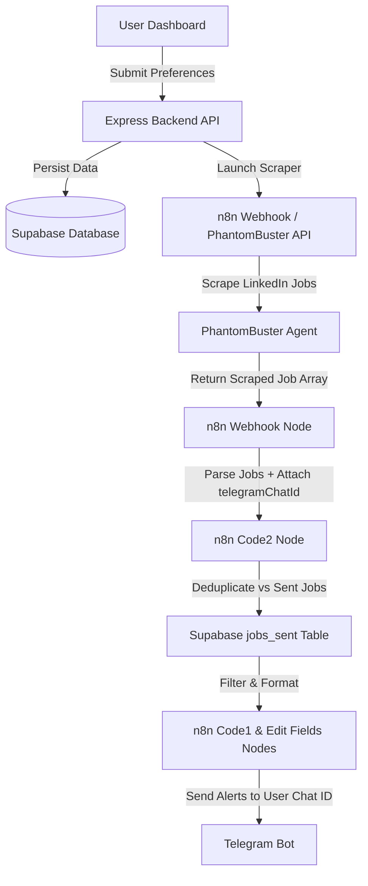

# Job Scraping Dashboard & n8n Workflow Integration Guide

## 🚀 Overview

This project transforms your existing personal **n8n job-scraping workflow** into a **multi-user job-scraping platform**. 

Users can submit their job preferences (job title, location, experience level, job type) and their **Telegram Chat ID** via a modern glassmorphism web dashboard. The backend securely persists preferences in **Supabase**, triggers your existing **n8n workflow** and **PhantomBuster** scraper with custom search queries, and delivers personalized job alerts directly to each user's specific Telegram account without mixing user data.

---

## 🏗️ System Architecture & Data Flow



### Key Highlights
1. **Dynamic Multi-User Routing:** The `telegramChatId` and `userId` flow through every node in your n8n workflow. Jobs scraped for **User A** are sent *only* to **User A's Telegram Chat ID**, and jobs for **User B** are sent *only* to **User B's Telegram Chat ID**.
2. **Reused n8n Nodes:** 100% of your original n8n workflow logic (`Code2`, `Convert`, `If2`, `Split`, `GetData`, `Merge`, `Code5`, `If`, `Edit Fields`, `If1`, `Insert Data`, `Wait`, `Code1`) has been preserved. Hardcoded parameters have been parameterized using n8n expressions.
3. **Automated Multi-User Scheduler:** The backend includes a `node-cron` service (`server/services/schedulerService.js`) that automatically iterates over all active user preferences in Supabase and launches scheduled job-scraping runs for each user periodically.

---

## 🛠️ Project Structure

```
Job/
├── Linkdin Job Scraber.json       # Updated multi-user n8n workflow JSON (Import into n8n)
├── supabase_schema.sql            # SQL Script to set up Supabase database tables & indexes
├── package.json                   # Project dependencies & scripts
├── .env.example                   # Environment configuration template
├── .env                           # Local environment configuration
├── server/                        # Express Backend API
│   ├── index.js                   # Server entrypoint & automated cron runner
│   ├── config/
│   │   └── supabase.js            # Supabase client setup
│   ├── models/
│   │   └── dbStore.js             # Supabase & hybrid local memory fallback database layer
│   ├── services/
│   │   ├── n8nService.js          # n8n Webhook dispatcher
│   │   ├── phantombusterService.js# PhantomBuster launch & LinkedIn query builder
│   │   └── schedulerService.js    # Multi-user automated cron scheduler
│   ├── controllers/
│   │   ├── preferencesController.js
│   │   ├── workflowController.js
│   │   └── historyController.js
│   └── routes/
│       └── api.js                 # API route definitions
└── src/                           # Dashboard Frontend
    ├── index.html                 # Glassmorphic responsive Dashboard interface
    ├── css/
    │   └── styles.css             # Modern styling system
    └── js/
        ├── app.js                 # UI interactions, form validation, & live polling
        └── api.js                 # Frontend API client
```

---

## 📋 Database Setup (Supabase)

Run the contents of `supabase_schema.sql` in your **Supabase SQL Editor**:

1. **`user_preferences`**: Stores user job search preferences (`job_keywords`, `location`, `experience_level`, `job_type`, `telegram_chat_id`, `is_active`).
2. **`job_searches`**: Stores workflow execution runs and real-time status (`Pending`, `Running`, `Completed`, `Failed`).
3. **`jobs_sent`**: Stores history of sent job alerts and powers n8n deduplication checks (`jobId`, `jobTitle`, `companyName`, `location`, `telegramChatId`).

---

## ⚡ How to Import the Updated Workflow into n8n

1. Open your **n8n instance** (e.g. `https://mridul565263.app.n8n.cloud`).
2. Open your workflow or create a new workflow.
3. Click on the **Menu (⋮)** in the top right -> **Import from File**.
4. Select `Linkdin Job Scraber.json`.
5. **What changed in your workflow:**
   * **Telegram Node:** Updated `Chat ID` parameter from static `-1002630615047` to expression `={{ $json.telegramChatId || '-1002630615047' }}`.
   * **Telegram1 Node (Error node):** Updated `Chat ID` parameter to expression `={{ $json.telegramChatId || '-1002630615047' }}`.
   * **Code2 Node:** Appends `telegramChatId`, `userId`, and `searchId` to every job item parsed from PhantomBuster.
   * **Edit Fields Node:** Retains `telegramChatId` and `userId` fields across execution.
   * **Insert Data Node:** Maps `telegramChatId` to Supabase `jobs_sent` table.
   * **HTTP Request Node:** Passes dynamic search URL (`searches`) and custom user metadata (`customData`) to PhantomBuster.

---

## 💻 Running the Dashboard & Backend Locally

1. **Install Dependencies:**
   ```bash
   npm install
   ```

2. **Configure Environment Variables in `.env`:**
   ```env
   PORT=5000
   SUPABASE_URL=https://your-supabase-project.supabase.co
   SUPABASE_ANON_KEY=your-supabase-anon-key
   N8N_WEBHOOK_URL=https://mridul565263.app.n8n.cloud/webhook/Fresher
   PHANTOMBUSTER_API_KEY=3DCQNMRZPJR2vM1ViNwq5UQ4Uo0fmwnus2n148n9qas
   PHANTOMBUSTER_AGENT_ID=5144990523661049
   AUTO_SCHEDULE_CRON=0 */6 * * *
   ```

3. **Start the Web Dashboard & API Server:**
   ```bash
   npm start
   ```

4. **Access Dashboard:**
   Open your browser at `http://localhost:5000`.

---

## 🧪 Testing Multi-User Search

### Scenario:
* **User A:**
  * Keywords: `Generative AI Intern`
  * Location: `Delhi`
  * Experience: `Internship`
  * Telegram Chat ID: `111222333`
* **User B:**
  * Keywords: `Desktop Support Engineer`
  * Location: `Noida`
  * Experience: `Fresher`
  * Telegram Chat ID: `444555666`

1. Submit User A's details on the dashboard form.
2. Observe status badge update to `Running` and search URL set to `https://www.linkedin.com/jobs/search/?keywords=Generative+AI+Intern&location=Delhi&f_E=1&f_JT=I`.
3. Submit User B's details.
4. Verify that User B's search parameters run independently and that jobs for User B are delivered strictly to `444555666`.

---

## 🔒 Security Best Practices

* Sensitive credentials (`PHANTOMBUSTER_API_KEY`, `SUPABASE_ANON_KEY`, `N8N_WEBHOOK_URL`) are strictly maintained on the backend in `.env` and are **never exposed** in client-side JavaScript code.
* User inputs are validated on both frontend and backend to prevent malformed requests.
